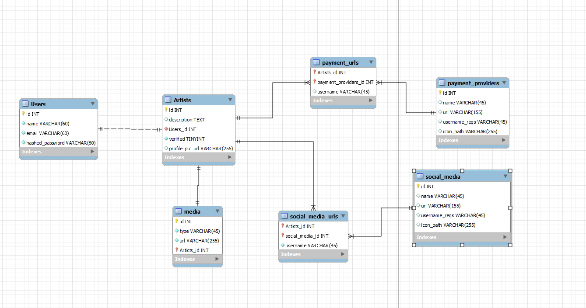

# For users interested in executing, testing, or reading the docs for this code:

## Windows users
For Windows, you may need to preface the below commands with `python -m`
Ex: `python -m uvicorn main:app --reload`

### Installing pip on Windows
Assuming you have python and curl installed, run the following commands
`curl https://bootstrap.pypa.io/get-pip.py -o get-pip.py`
`python get-pip.py`

## Downloading required packages
`pip install -r requirements.txt`

## Running the Api
`uvicorn main:app --reload`

## Swagger
Append `/docs` to the end of the URL for the Swagger page
Ex: `http://localhost:8000/docs`

---

# For maintainers:

## Code that should (and should NOT) be tinkered with

### Files *NOT* to mess with (unless you really understand what you're doing...):
* Anthing in the `./` top-level repository directory (e.g., main.py, Dockerfile, fly.toml, etc.); these are largely used to define the build process for the codebase
* Anything in the `/alembic/` directory (this code handles automatic db migrations across codebase versions)
* Anything in the top-level of `/api/` (i.e., __init__.py & database.py, which currently handle connections to the database and the API)
* Anything in the `/api/auth/` directory (this all handles user authentication and sessions; without it, folks can't log in)
* Anything in the `/api/utils/` directory (which currently handles common functionality like uploading files to storage buckets and converting python syntax to SQL)

### Files that *CAN* be tinkered with (if you're working on adding new functionality to the API, but don't want to break existing things...):
* You should probably restrict your development to files in `/api/` subdirectories that were *NOT* listed in the *DON'T MESS WITH* section
  * Models (`/api/models/`) use sqlalchemy functionality to explicitly define fields and data types to be returned by a particular type of database query.
    * Formatting and conventions:
      * New model scripts should be made for each database table, and typically each of these files just contains one model class per table; files should be named singularly (i.e., without an "s", so the model file corresponding to the 'artists' table in the database should be saved in `/api/models/artist.py`)
      * New class names should be given the same name as the database table that they refer to, but with the following changes:
        * Database table names are plural (i.e., ending with an "s"), but model names are singular (e.g., artists --> Artist)
        * `_`'s should be removed from the table name (e.g., payment_urls --> PaymentUrl)
        * Table names should be converted to ProudCamelCase (i.e., capitalize the first letter of each word, including the first word)
      * When defining new model classes, make sure to include the database table name that the model corresponds to as the first property, `__tablename__`
      * Use sqlalchemy data types (e.g., Integer, String, ForeignKey) when typing additional fields for the model
      * Any foreign keys included in the database table should be typed as `mapped_column(ForeignKey("{parent_table}.id"))`
      * Any linked (via foreign keys) tables should be typed using `relationship("{NameOfModelClassForLinkedTable}"); if relevant, you can also use the following args to alter the link between the models:
        * `back_populates="{database_table_name}"`
        * `lazy='joined'`
  * Schemas (`/api/schemas/`) use pydantic to define the fields and data types that should be expected as a response value for a given API call.
    * Formatting and conventions:
      * New schema scripts should be made for each controller file, containing all relevant response schemas for a given controller file; files should be named singularly (i.e., without an "s", so the schema file corresponding to `/api/controllers/artists.py` should be saved in `/api/schemas/artist.py`)
      * New classes should be made for each different combination of data that could be needed for an API response
      * Class names should follow the same rules for `_`'s and capitalization (i.e., ProudCamelCase), but they should also contain information in their name describing what the resulting set of fields will be used for in the API
        * For instance, a schema that defines the data to be returned after an API call to update an artist record might be named `ArtistUpdate`, which tells us that the schema is for "Artist" API calls and that it should be returned after an "Update" request
      * All schemas should inherit (at some point back in their inheritance) from the pydantic `BaseModel`, which allows for other pydantic functionality to be accessed; if making the first schema for a particular file, you can do this via:
      ```
      class SchemaName(BaseModel):
        {schema-y things}
      ```
      * If the schema will be used with fancy sqlalchemy ORM functionality (as most in the current codebase do), then make sure that the schema is configured into ORM mode by adding a nested class to the schema (this only needs to be done once at the beginning of an inheritance chain); e.g.:
      ```
      class SchemaName(BaseModel):
        {schema-y things}
        class Config:
          orm_mode = True
      ```
      * Make sure that your schema class has all variables needed for the response (and bear in mind that variables can also be defined in schema classes that the current one inherits from); In the following code, `SchemaAnotherName` would be defined as holding an `id` field of type `int`, as well as a `name` field of type `str` and a `Config` nested class with property `orm_mode` set to `True`:
      ```
      class SchemaName(BaseModel):
        name: str
        class Config:
          orm_mode = True
      class SchemaAnotherName(SchemaName):
        id: int
      ```
      * If a specific pydantic data type (e.g., EmailStr, AnyHttpUrl) better describes a schema field than any vanilla python types (e.g., int, str, bool), use the specific pydantic type.
  * Controllers (`/api/controllers/`) use the model and schema files (defined in the previous two folders) to do the heavy lifting of querying the database (with the help of the data model), using basic python logic to convert the database output into the final version of the data, and then sending the data to the frontend (with the help of the schema).
    * Formatting and conventions:
      * All controllers for a given database table should be saved together into one controller script, this time named plurally (i.e., with an "s"), so the controller script for the artists table should be named 'artists.py'
      * __WIP__: Keep filling me out!
 
## ERD for the associated db


## Alembic Database Management Commands
Creates the tables in your database

### Generate a new migration based on changes to models in api/models
`alembic revision --autogenerate`

### Run all new migrations
`alembic upgrade head`
